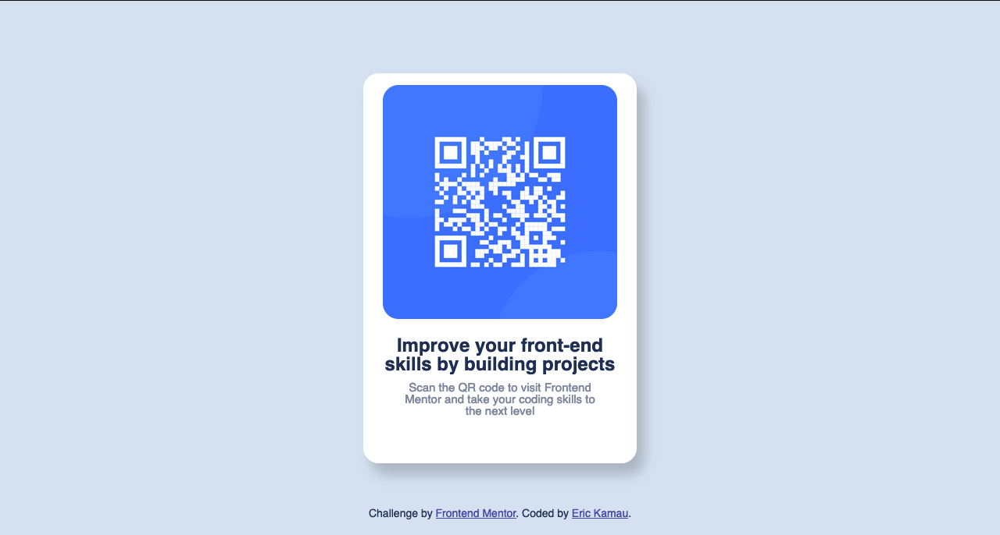

# Frontend Mentor - QR code component solution

This is a solution to the [QR code component challenge on Frontend Mentor](https://www.frontendmentor.io/challenges/qr-code-component-iux_sIO_H). Frontend Mentor challenges help you improve your coding skills by building realistic projects.

## Table of contents

- [Overview](#overview)
  - [Screenshot](#screenshot)
  - [Links](#links)
  - [Built with](#built-with)
  - [What I learnt](#what-i-learnt)
  - [Useful resources](#useful-resources)
- [Author](#author)

## Overview

Build out a QR code component and get it looking as close to the provided design as possible.

### Screenshot



### Links

- Solution URL: [The actual Code](https://github.com/kamauEr/qr-code-component)
- Live Site URL: [live site URL](https://kamauer.github.io/qr-code-component)

## My process

### Built with

- Semantic HTML5 markup
- CSS custom properties
- Flexbox

### What I learnt

I learnt how to change the flex-direction of components to easily arrange them in a layout.

```css
body {
  min-height: 100vh;
  background-color: hsl(212, 45%, 89%);
  display: flex;
  flex-direction: column;
  align-items: center;
  justify-content: center;
}
```

### Useful resources

- [Stack overflow](https://stackoverflow.com/questions/71175792/how-do-i-center-and-stack-2-items-in-a-flexbox) - This is an amazing article which helped me finally understand how to stack 2 items in a flexboz. I'd recommend it to anyone still learning this concept.

## Author

- Website - [Eric Kamau](https://github.com/kamauEr)
- Frontend Mentor - [@kamauEr](https://www.frontendmentor.io/profile/kamauEr)
- Twitter/X - [@erico_Kamau](https://www.x.com/erico_Kamau)
